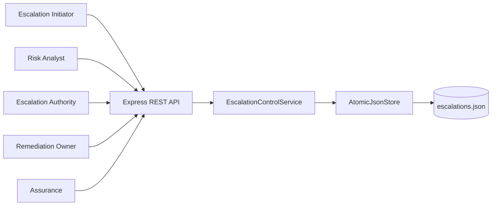
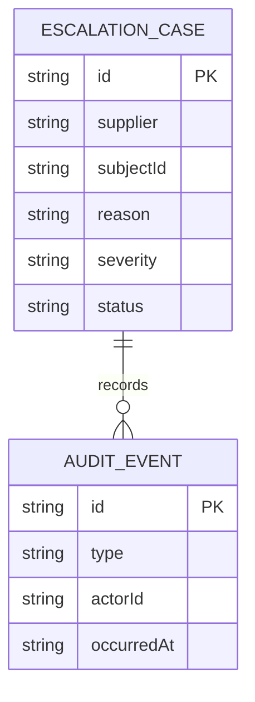
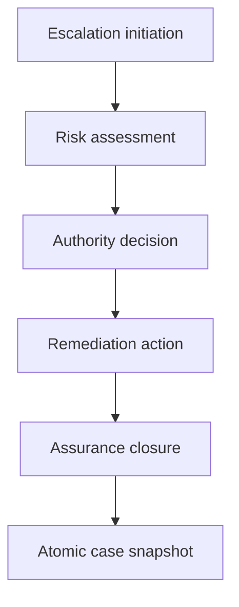
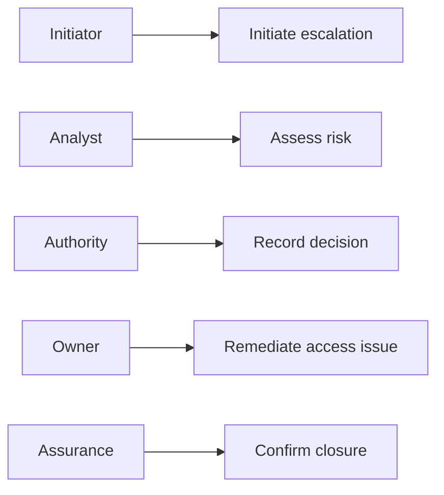
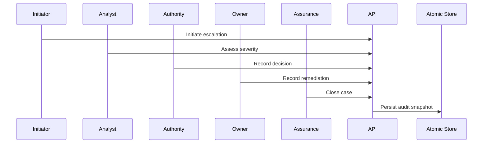

# Supplier Evidence Access Escalation Control Platform

## The Problem

Critical supplier evidence access issues become harder to resolve when initiation, risk assessment, authority decisions, remediation, and closure confirmation are distributed across separate communications. The resulting record does not reliably establish who accepted the risk or whether remediation was independently confirmed.

## The Solution

This service controls escalations through an ordered, role-gated workflow. It records initiation, risk assessment, authority decision, remediation evidence, and assurance closure in one atomic case record with an event trail for every accepted action.

## Live Demo and Tech Stack

Start the service and visit `http://localhost:63600/health` to confirm readiness. The stack uses Node.js 22, Express 5, ESM JavaScript, atomic JSON persistence, Vitest, and GitHub Actions.

| Layer | Implementation | Responsibility |
| --- | --- | --- |
| HTTP API | Express 5 | Escalation lifecycle routes and errors |
| Control domain | ESM JavaScript | Role gates, state progression, and audits |
| Persistence | Node file system | Temporary snapshot and atomic rename |
| Verification | Vitest and GitHub Actions | Tests and continuous integration |

## Local Setup and Run Instructions

```bash
git clone https://github.com/kholipha-ahmmad-al-amin/supplier-evidence-access-escalation-control-platform.git
cd supplier-evidence-access-escalation-control-platform
npm install
npm test
npm start
```

The service binds to `0.0.0.0:63600` for approved local area network use.

## System Documentation

### System Architecture Diagram


### Entity-Relationship Diagram


### Data Flow Diagram


### Use Case Diagram


### Sequence Diagram


## Owner

Created and maintained by Kholipha Ahmmad Al-Amin.

Software Engineer and AI Specialist

Founder and CEO of EquiSaaS BD

Principal Consultant at AR IT Consultancy

Full Stack Developer and SaaS Product Builder

### Official links

Portfolio: https://kholipha-ahmmad-al-amin.equisaas-bd.com/

GitHub: https://github.com/kholipha-ahmmad-al-amin

LinkedIn: https://www.linkedin.com/in/kholipha-ahmmad-al-amin

X: https://x.com/al_amin5519

Facebook: https://www.facebook.com/kholipha.ahmmad.al.amin

Instagram: https://www.instagram.com/kholipha.ahmmad.al.amin

## Ownership

This project was created and is maintained by Kholipha Ahmmad Al-Amin.
